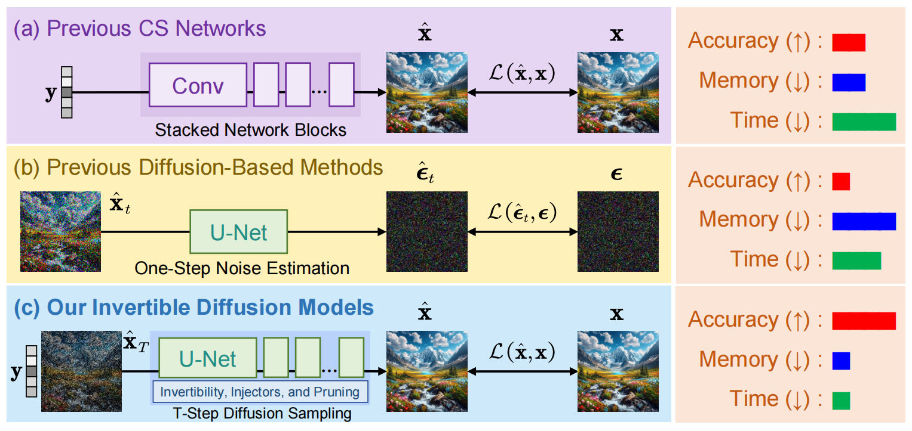

# (TPAMI 2025) Invertible Diffusion Models for Compressed Sensing [PyTorch]

[](https://github.com/Guaishou74851/IDM) [](https://arxiv.org/abs/2403.17006) 

[Bin Chen](https://scholar.google.com/citations?user=aZDNm98AAAAJ), [Zhenyu Zhang](https://scholar.google.com/citations?user=4TbicrcAAAAJ), [Weiqi Li](https://scholar.google.com/citations?user=SIkQdEsAAAAJ), [Chen Zhao](https://chenzhao.netlify.app/)†, [Jiwen Yu](https://vvictoryuki.github.io/website/), Shijie Zhao, [Jie Chen](https://aimia-pku.github.io/), and [Jian Zhang](https://jianzhang.tech/)

*School of Electronic and Computer Engineering, Peking University, Shenzhen, China.*

*King Abdullah University of Science and Technology, Thuwal, Saudi Arabia.*

*ByteDance Inc, Shenzhen, China.*

† Corresponding author

Accepted for publication in [IEEE Transactions on Pattern Analysis and Machine Intelligence](https://ieeexplore.ieee.org/xpl/RecentIssue.jsp?punumber=34) (TPAMI) 2025.

## Abstract

While deep neural networks (NN) significantly advance image compressed sensing (CS) by improving reconstruction quality, the necessity of training current CS NNs from scratch constrains their effectiveness and hampers rapid deployment. Although recent methods utilize pre-trained diffusion models for image reconstruction, they struggle with slow inference and restricted adaptability to CS. To tackle these challenges, this paper proposes **I**nvertible **D**iffusion **M**odels (**IDM**), a novel efficient, end-to-end diffusion-based CS method. IDM repurposes a large-scale diffusion sampling process as a reconstruction model, and fine-tunes it end-to-end to recover original images directly from CS measurements, moving beyond the traditional paradigm of one-step noise estimation learning. To enable such memory-intensive end-to-end fine-tuning, we propose a novel two-level invertible design to transform both (1) multi-step sampling process and (2) noise estimation U-Net in each step into invertible networks. As a result, most intermediate features are cleared during training to reduce up to 93.8% GPU memory. In addition, we develop a set of lightweight modules to inject measurements into noise estimator to further facilitate reconstruction. Experiments demonstrate that IDM outperforms existing state-of-the-art CS networks by up to 2.64dB in PSNR. Compared to the recent diffusion-based approach DDNM, our IDM achieves up to 10.09dB PSNR gain and 14.54 times faster inference. Code is available at https://github.com/Guaishou74851/IDM.

## Overview




## Environment

```shell
torch==2.3.1+cu121
diffusers==0.30.2
transformers==4.44.2
numpy==1.26.3
opencv-python==4.10.0
scikit-image==0.24.0
```

## Test

```shell
python test.py --max_ratio=0.1/0.3/0.5 --testset_name=Set11/CBSD68/Urban100/DIV2K
```

The reconstructed images will be in `./result`.

## Train

Download `Training_Data.mat` from [Google Drive](https://drive.google.com/file/d/14CKidNsC795vPfxFDXa1FH9QuNJKE3cp) or [PKU NetDisk (北大网盘)](https://disk.pku.edu.cn/anyshare/link/AA2856882B7621432B826D00CE1C0E2E5B) and put it into `./data`, then run:

```shell
python train.py --max_ratio=0.1/0.3/0.5
```

The log and model files will be in `./log` and `./weight`, respectively.

## Citation

If you find the code helpful in your research or work, please cite the following paper:

```latex
@article{chen2024self,
  title={Self-supervised Scalable Deep Compressed Sensing},
  author={Chen, Bin and Zhang, Xuanyu and Liu, Shuai and Zhang, Yongbing and Zhang, Jian},
  journal={International Journal of Computer Vision},
  pages={1--36},
  year={2024},
  publisher={Springer}
}
```
